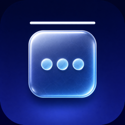

    
    <h1>Floe</h1>

Floe is a personal macOS menu bar manager. It is a maintained fork of
[Ice](https://github.com/jordanbaird/Ice), with a separate app identity and
macOS 26 Ice Bar compatibility fixes.

> [!NOTE]
> Floe does not publish binary releases, a Homebrew cask, or an automatic
> update feed yet. Build it from source for personal use.

## Install from source

1. Install Xcode from the Mac App Store and open `Ice.xcodeproj`.
2. Select the **Ice** target, open **Signing & Capabilities**, and select your
   Personal Team. The target name remains Ice internally; the built app is
   named **Floe**.
3. Select the **Ice** scheme and press `⌘R` to build and run Floe.
4. Grant Floe Accessibility permission when macOS asks. Grant Screen Recording
   permission too when you use Floe Bar or menu bar layout features.

## Features

### Menu bar item management

- Hide menu bar items
- Keep an always-hidden menu bar section
- Show hidden menu bar items by hover, click, scrolling, or swiping
- Automatically rehide menu bar items
- Arrange individual menu bar items with drag and drop
- Display hidden menu bar items in Floe Bar
- Search menu bar items
- Adjust menu bar item spacing

### Menu bar appearance

- Tint, shadow, and border controls
- Custom menu bar shapes

### Other

- Global hotkeys
- Launch at login

## License and attribution

Floe is distributed under the [GPL-3.0 license](LICENSE). It is derived from
Ice by Jordan Baird; original copyright notices and third-party license notices
are retained. Floe-specific changes are identified in this repository's commit
history.
